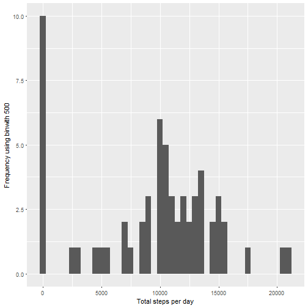
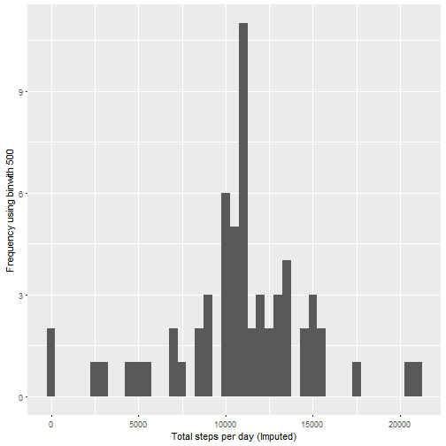
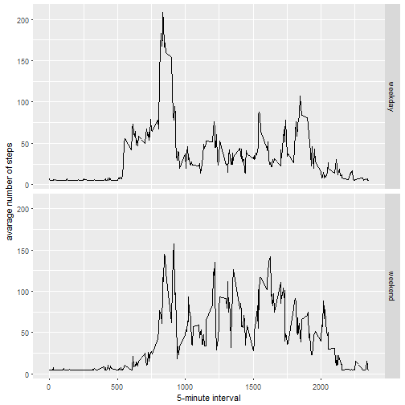

# "Reproducible Research: Peer Assessment 1"

## Loading and preprocessing the data


```r
activity<-read.csv("activity.csv",stringsAsFactors = F)
activity<-data.frame(activity)
```

## What is mean total number of steps taken per day?

```r
dailyactivity<-tapply(activity$steps,activity$date,sum,na.rm=T)
```

#### 1. Make a histogram of the total number of steps taken each day


```r
qplot(dailyactivity, xlab='Total steps per day', ylab='Frequency using binwith 500',binwidth=500)
```



#### 2. Calculate and report the mean and median total number of steps taken per day


```r
meandailyactivity<-mean(dailyactivity)
mediandailyactivity<-median(dailyactivity)
```
* Mean: 9354.2295082 
* Median: 10395

## What is the average daily activity pattern?


```r
interval<-aggregate(activity$steps,by=list(activity$interval),mean,na.rm=T)
colnames(interval) <- c("averageinterval","steps")
```

#### 1. Make a time series plot


```r
plot(interval,type = "l",main = "Average Steps per Interval",xlab = "Interval",ylab = "Average Steps")
```


#### 2. Which 5-minute interval, on average across all the days in the dataset, contains the maximum number of steps?


```r
maxinterval <- interval$averageinterval[which.max(interval$steps)]
```
* Max Interval: 835

## Imputing missing values
#### 1. Calculate and report the total number of missing values in the dataset 


```r
sum(is.na(activity$steps) | is.na(activity$interval))
```

```
## [1] 2304
```

#### 2. Devise a strategy for filling in all of the missing values in the dataset.
#### 3. Create a new dataset that is equal to the original dataset but with the missing data filled in.


```r
activityImputed<-activity
activityImputed$steps <- impute(activity$steps, fun=mean)
```

#### 4. Make a histogram of the total number of steps taken each day 


```r
stepsByDayImputed <- tapply(activityImputed$steps, activityImputed$date, sum)
qplot(stepsByDayImputed, xlab='Total steps per day (Imputed)', ylab='Frequency using binwith 500', binwidth=500)
```



#### 5. and Calculate and report the mean and median total number of steps taken per day. 


```r
stepsByDayMeanImputed <- mean(stepsByDayImputed)
stepsByDayMedianImputed <- median(stepsByDayImputed)
```
* Mean: 1.0766189 &times; 10<sup>4</sup>
* Median:  1.0766189 &times; 10<sup>4</sup>

## Are there differences in activity patterns between weekdays and weekends
#### 1. Create a new factor variable in the dataset with two levels - "weekday" and "weekend" indicating whether a given date is a weekday or weekend day.


```r
weekend <- weekdays(as.Date(activityImputed$date)) %in% c("Saturday", "Sunday")
activityImputed$daytype <- "weekday"
activityImputed$daytype[weekend == TRUE] <- "weekend"
activityImputed$daytype <- as.factor(activityImputed$daytype)
```

#### 2. Make a panel plot containing a time series plot


```r
averagedActivityDataImputed <- aggregate(steps ~ interval + daytype, data=activityImputed, mean)
ggplot(averagedActivityDataImputed, aes(interval, steps)) +geom_line() +facet_grid(daytype ~ .) +xlab("5-minute interval") +ylab("avarage number of steps")
```


